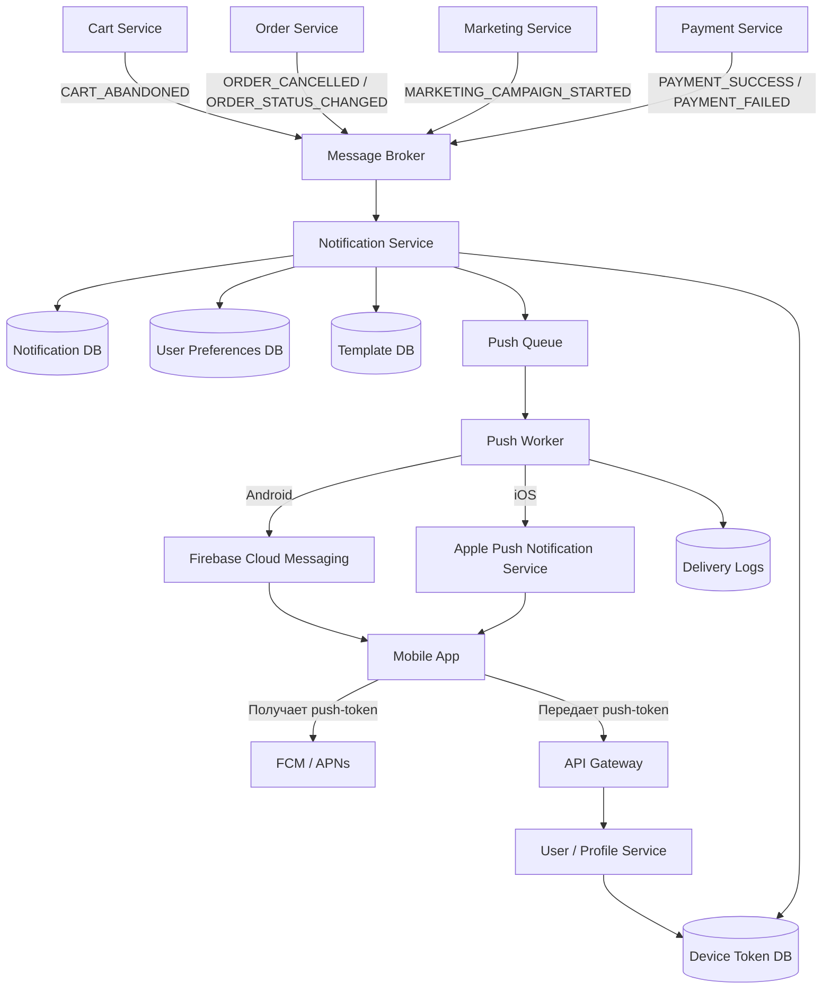

# Верхнеуровневая схема PUSH-уведомлений

## Краткое описание схемы

1. Мобильное приложение получает `pushToken` от FCM/APNs.
2. Приложение передает токен через API Gateway в User/Profile Service.
3. User/Profile Service сохраняет токен устройства в Device Token DB.
4. Бизнес-сервисы публикуют события в Message Broker.
5. Notification Service получает события, проверяет настройки пользователя и формирует уведомление.
6. Push Worker отправляет уведомление через FCM/APNs.
7. Результат отправки сохраняется в Delivery Logs.
