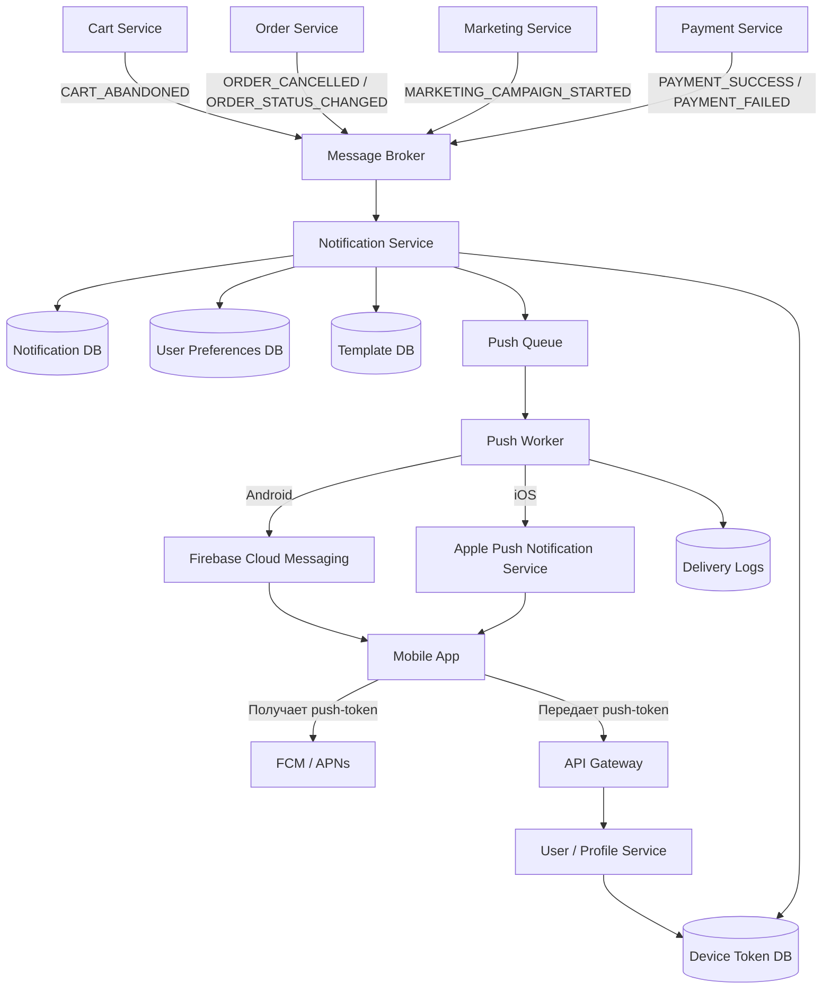

# Задание 3. Архитектура PUSH-уведомлений

## Описание задачи

В мобильное приложение интернет-магазина «Петрушка Зеленая» необходимо добавить функционал PUSH-уведомлений.

Типы уведомлений могут быть разными:

- пользователь долго не оформляет корзину;
- заказ отменен;
- заказ изменил статус;
- рекламная рассылка;
- персональное предложение;
- уведомление об оплате или доставке.

Backend считаем микросервисным.

---

## 1. Верхнеуровневая архитектура



---

## 2. Основные компоненты

### Mobile App

Мобильное приложение получает `pushToken` от FCM/APNs после разрешения пользователя на получение PUSH-уведомлений.

Далее приложение передает токен на backend.

Пример данных:

```json
{
  "userId": "12345",
  "deviceId": "ios-device-001",
  "platform": "ios",
  "pushToken": "example_push_token",
  "pushEnabled": true
}
```

### API Gateway

Единая точка входа для мобильного приложения. Передает запрос регистрации push-токена в User/Profile Service.

### User / Profile Service

Хранит связь пользователя с его устройствами и push-токенами.

Один пользователь может иметь несколько устройств, например iPhone и Android-смартфон.

### Device Token DB

База push-токенов устройств.

Пример полей:

```text
userId
deviceId
platform
pushToken
isActive
createdAt
updatedAt
```

### Cart Service

Отвечает за корзину пользователя.

Может создать событие `CART_ABANDONED`, если пользователь добавил товары в корзину, но долго не оформляет заказ.

### Order Service

Отвечает за заказы.

Может создать события:

```text
ORDER_CREATED
ORDER_CANCELLED
ORDER_STATUS_CHANGED
ORDER_DELIVERED
```

### Marketing Service

Отвечает за рекламные рассылки, акции и персональные предложения.

Может создать событие `MARKETING_CAMPAIGN_STARTED`.

### Message Broker

Брокер сообщений, например Kafka или RabbitMQ.

Бизнес-сервисы не отправляют PUSH напрямую, а публикуют события в брокер.

Это снижает связанность между микросервисами.

### Notification Service

Главный сервис уведомлений.

Он:

1. получает события из брокера;
2. определяет тип уведомления;
3. проверяет настройки пользователя;
4. получает push-токены пользователя;
5. получает шаблон уведомления;
6. формирует текст уведомления;
7. кладет задачу на отправку в очередь;
8. сохраняет результат обработки.

### User Preferences DB

Хранит настройки уведомлений пользователя.

Например:

```text
systemPushEnabled = true
marketingPushEnabled = false
orderPushEnabled = true
quietHoursFrom = 22:00
quietHoursTo = 08:00
```

### Template DB

Хранит шаблоны уведомлений.

Пример шаблона:

```text
Тип: ORDER_CANCELLED
Заголовок: Заказ отменен
Текст: Ваш заказ №{orderId} был отменен.
```

### Push Queue

Очередь задач на отправку PUSH.

Она нужна, чтобы Notification Service не зависел напрямую от скорости работы FCM/APNs.

### Push Worker

Воркер берет задачи из очереди и отправляет PUSH через внешний push-провайдер.

Для Android используется Firebase Cloud Messaging.

Для iOS используется Apple Push Notification Service.

### Delivery Logs

Хранит историю отправок и ошибки.

Пример полей:

```text
notificationId
userId
type
status
title
body
createdAt
sentAt
errorMessage
```

---

## 3. Сценарий: брошенная корзина

```text
1. Пользователь добавил товары в корзину.
2. Cart Service сохранил корзину.
3. Пользователь долго не оформляет заказ.
4. Cart Service или Scheduler создает событие CART_ABANDONED.
5. Событие попадает в Message Broker.
6. Notification Service получает событие.
7. Notification Service проверяет настройки пользователя.
8. Notification Service получает push-токен пользователя.
9. Notification Service формирует текст уведомления.
10. Push Worker отправляет PUSH через FCM/APNs.
11. Пользователь получает уведомление в мобильном приложении.
12. Результат отправки сохраняется в Delivery Logs.
```

Пример события:

```json
{
  "eventType": "CART_ABANDONED",
  "userId": "12345",
  "cartId": "cart-987",
  "createdAt": "2026-07-07T10:00:00Z"
}
```

---

## 4. Сценарий: отмена заказа

```text
1. Заказ был отменен.
2. Order Service создает событие ORDER_CANCELLED.
3. Событие попадает в Message Broker.
4. Notification Service получает событие.
5. Notification Service находит шаблон уведомления.
6. Notification Service получает push-токены пользователя.
7. Push Worker отправляет уведомление через FCM/APNs.
8. Результат отправки сохраняется в Delivery Logs.
```

Пример события:

```json
{
  "eventType": "ORDER_CANCELLED",
  "userId": "12345",
  "orderId": "98765",
  "createdAt": "2026-07-07T10:00:00Z"
}
```

---

## 5. Что нужно проверять перед отправкой PUSH

Перед отправкой Notification Service должен проверить:

- пользователь разрешил PUSH-уведомления;
- push-токен активен;
- пользователь не отключил конкретный тип уведомлений;
- не наступил период «тихих часов»;
- не превышен лимит рекламных уведомлений;
- событие не было обработано повторно;
- шаблон уведомления существует;
- пользователь подходит под сегмент рекламной кампании.

---

## 6. Повторные попытки и ошибки

Если отправка временно не удалась, Push Worker может выполнить повторные попытки.

Пример:

```text
1-я попытка — сразу
2-я попытка — через 1 минуту
3-я попытка — через 5 минут
```

Если FCM/APNs возвращает ошибку, что push-токен недействителен, система помечает токен как неактивный.

---

## 7. Почему бизнес-сервисы не должны отправлять PUSH напрямую

Если Cart Service, Order Service и Marketing Service будут напрямую отправлять PUSH, появятся проблемы:

- дублирование логики отправки;
- сложнее менять шаблоны уведомлений;
- сложнее контролировать лимиты;
- сложнее учитывать пользовательские настройки;
- каждый сервис будет зависеть от FCM/APNs;
- сложнее масштабировать отправку.

Поэтому лучше выделить отдельный Notification Service.

---

## 8. Что можно обсудить на собеседовании

На собеседовании по этому решению можно объяснить:

1. Почему выбрана событийная архитектура.
2. Зачем нужен Message Broker.
3. Почему PUSH-отправку лучше вынести в отдельный Notification Service.
4. Где хранить push-токены устройств.
5. Как учитывать настройки пользователя.
6. Как обрабатывать рекламные рассылки.
7. Как избежать дублей уведомлений.
8. Как логировать результат отправки.
9. Как делать retry при временных ошибках.
10. Что делать с невалидными push-токенами.

---

## Итог

Предложенная архитектура позволяет централизованно управлять PUSH-уведомлениями в микросервисном backend. Новые типы уведомлений можно добавлять через новые события и шаблоны, не изменяя логику всех бизнес-сервисов.
